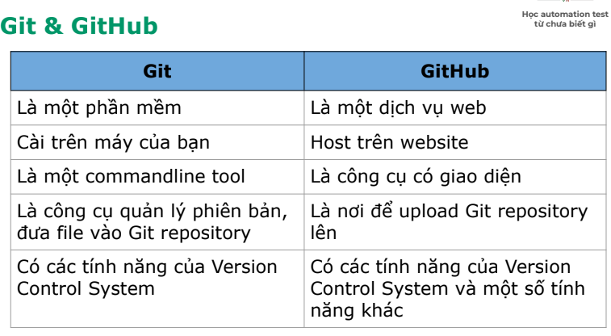
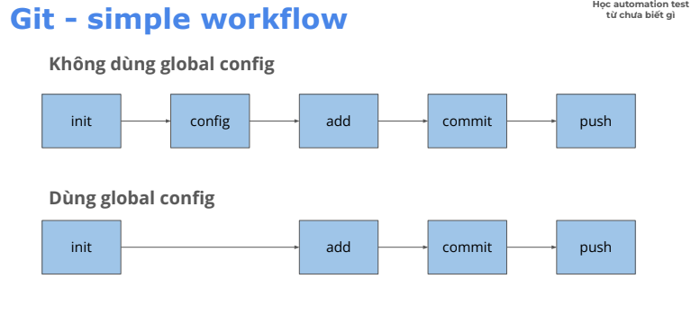

# 1. Version control system (VSC)
- Hệ thống quản lý các phiên bản
ví dụ: gg doc
- VSC có 3 phần chính
  + Local: lưu ở máy cá nhân
  + Centralize: lưu ở 1 máy chủ tập chung
  + Distributed: lưu ở nhiều máy khác nhau

# Git
- Khái niệm: được viết bởi cha đẻ linux
+ Git là từ viết sai chính tả (có chủ đích) của get, do get đã được dùng rồi
+ dùng git do nhu cầu quản lý phiên bản và làm việc giữa nhiều người vs nhau

- so sánh git và các vsc khác 
+ tính năng: Dễ dùng, có nhiều tính năng vượt trội: branching, tốc độ xử lý nhanh
+ chi phí: free
+ Phổ biến: nhiều công ty sử dụng

- câu lệnh thường dùng:
+ khởi tạo thư mục được quản lý bởi git
    git init

+ cấu hình : sau khi cài đặt xong, cần cấu hình git:
  + cho 1 repo :

  git config user.name"<tencuaban>"
  git config user.email"<emailcuaban>"

  + cho toàn bộ máy tính (default)

  git config --global user.name "user" 
  git config --global user.email "email"

+ thêm file vào vùng staging
  - Thêm 1 file: git add <file_name>
  - Thêm toàn bộ: git add .

+ Xem trạng thái file: git status
  - file màu xanh: vùng staging
  - file màu đỏ: vùng working directory

+ commit:
 git commit -m "message"
 - Kiểm tra lịch sử commit: git log

+ commit convention 
 - convention = quy tắc
 - convention giúp :
 + Cả team làm việc với nhau theo 1 quy tắc
 + Code gọn gàng sạch đẹp hơn
- cách sử dụng 
 + commit message cần rõ ràng, chuyên nghiệp
 + trong lớp dùng convention sau:
   <type>: <short_decription>
 + trong đó:
  - type: loại commit 
       + Chore: sửa nhỏ lẻ, chính tả, xoá file không dùng tới,...
       + feat: thêm tính năng mới, test case mới
       + fix: sửa lỗi 1 test trước đó
  - short_description : mô tả ngắn gọn (50 ký tự), eng hoặc VN không dấu
  Ví dụ : 
  + "Chore : remote unused file"
  + "feat : add code for exerciser 2"
  
  

# Javasript
+ Khái niệm: là 1 ngôn ngữ lập trình được ra đời vào năm 1995
+ Giúp cho browser hoạt động được
+ top language
+ Bình thường Javascript chạy được do browser engine support
  - edge: chaka
  - filefox: spidermonkey
  -chrome: V8
+ Để chạy được trên máy tính không cần trình duyệt, cần node js
+ run-time

1. hello world
+ tạo thư mục 
+ mở bằng vs code: code .
+ Tạo file: 01-hello.js
+ Ghi vào dòng:
console.log("hello world");
+ Chạy lệnh: node ( copy relative path)

2. Var (biến)
- Khái niệm biến dùng để lưu trữ giá trị có thể thay đổi giá trị được.
 Khai báo:
  + var <ten_bien> = <gia_tri>;
  + let <ten_bien> = <gia_tri>;
trong đó: <ten_bien>
  + Bắt đầu bằng ký tự chữ hoặc gạch dưới hoặc dấu $
  + Không chứa dấu cách
  + Không là các "từ khoá", tức là đã có các từ đã có trong js (ví dụ: var, let, for, if,...) 
  Ví dụ : 
  var firstName = "PlayWright";
  let lastName = "Auto test";
  console.log("firstname = " + firstName);
  console.log("lastName = " + lastName);

  Gán lại 
  lastName = "lesson 2";
  kiểm tra 
  console.log("lastName = " + lastName);

+ Khác nhau giữa var và let ?
- var khai báo lại được, let thì không
  var item1 = 'a';
  var item2 = 'c'; // OK

  let item2 = 'b'
  let item2 = 'd' // error
- Phạm vi của biến
 + var: phạm vi toàn cục (global)
 + let: phạm vi trong cặp ngoặc {}
- Nên dùng: let, vì dễ kiểm soát phạm vi của biến

3. Const (hằng)
Constant = hằng số. Dùng để khai báo các giá trị không thể thay đổi
 + Khai báo 
   - const <name> = <value>
  Ví dụ:
   const frameWork = "Playwright";
  sử dụng: 
  console.log(framework);
  Gán lại
  framework = "cypress" // error

  Note: khi nào dùng var/let khi nào dùng const
  + var let: khi biến gán lại
  + const: khi biến không gán lại
  + thường dùng let và const, không dùng var

4. data types (kiểu dữ liệu)
+ Có 8 loại kiểu dữ liệu: String, Number, Bigint, Boolean, Undefined, Null, Symbol, Object
+ String dùng để khai báo chuỗi
+ number dùng khai báo 1 số.
+ boolean dùng để khai báo giá trị đúng, sai (true, false)

5. Comparision operator (toán tử so sánh)
+ So sánh hơn kém >,<
+ So sánh bằng ==, ===, !=, !==, >=, <=
ở buổi 2 tập trung dùng ss hơn kém và 1 bào so sánh bằng (===, !==, >=, <=)

6 Unary operator = toán tử 1 ngôi
+ Dùng để tăng hoặc giảm giá trị
i++ bằng vs i= i+1
i-- bằng với i=i-1

7. Arithmetic operator = toán tử số học
dùng tính toán biểu thức 
cac phép toán + - * /

8. conditional (điều kiện)
dùng để kiểm tra xem có nên thực hiện 1 đoạn logic không.
cú pháp: if(<điều kiện>) {// code}
nếu đk đúng code sẽ chạy
ví dụ 
   if (5 > 3) {
    console.log("5 lớn hơn 3)

   }

9. loops (vòng lặp)
-Dùng để thực hiện 1 đoạn logic 1 số lần nhất định
- Cú pháp: for(<khơi tạo>; <điều kiện dừng>; <điều kiện tăng>)
{//code}
- ví dụ:
for (let i = 1; i <= 10; i++>) {
    console.log("giá trị của i là: ", i)
}

format code 
window: alt + shift + f