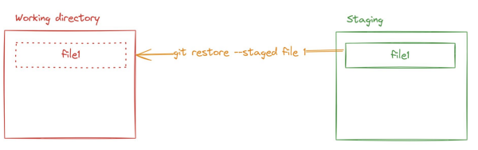
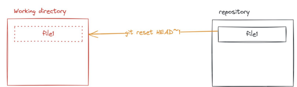
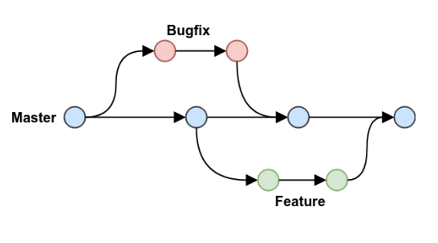

# Git & Javascript basic

# Git (undo things) 

+ Thay đổi commit message.
    git commit --amend
    - Gõ i -> vào chế độ insert
    - Gõ esc để thoát insert
    - Gõ ":wq" -> write and quit
          // cau lenh tong 
           git commit --amend -m "message"

+ Đưa từ vùng staging về working directory
       git restore --staged <file>
   

+ Đưa từ vùng repository về working directory (undocommit)
  git reset HEAD~1  (undo 1 commit)
  

+ Branching model
  + Branch = nhánh
  dùng branch để tạo ra 1 vùng làm việc mới, không ảnh hưởng tới vùng làm việc còn lại
  
  + Không có branch
  - backup file ra chỗ khác, copy lại.
  
  + Tạo branch
      git branch <ten_branch>
      git checkout <ten_branch>
      git checkout -b <ten_branch>  (mer 2 cái trên)

Tips: luôn tạo branch mới trước khi copy từ internet

+ .gitignore file 
.gitignore = GitIgnore = bỏ qua
Dùng để bỏ qua các file không cần git theo dõi
Ignore file
<file_name>
Ignore folder
<folder-name>/

# Javascript

+ Conventions
  snake_case: chưa dùng
  kebab-case: tên file
  camelCase: tên biến
  PascalCase: tên case

+ Console.log with ` and "
+ Formatted console.log

console.log(`Toi la Nga`);
console.log("Toi la Phong");
console.log(`${variaber_name}`)
let name = `Nga`;
console.log(`Toi la ${name}');
console.log("Toi ten la" + name + "" )

+ Object 
Đối tượng, dùng để lưu trữ tập hợp các giá trị vào cùng 1 biến hoặc hằng số
+ Khai báo:
let/const <ten_object> = {
<thuoc_tinh>: <gia_tri>,
...
}

Trong đó:
- <thuoc_tinh>: giống quy tắc đặt tên biến
- <gia tri>: có kiểu giống biến hoặc là 1 object khác.

+ Logical operator
  && : cả 2 vế của mệnh đề đều đúng
  || : một trong 2 vế đúng
  !: đảo ngược lại giá trị của mệnh đề

+ Array: Mảng
  + Tạo mảng
    - Khai báo
    - Sử dụng
  + Truy xuất mảng
    - Độ dài mảng: length
    - lấy phần tử theo index: [0], [1], [2]

+ Function (hàm) 
  Hàm, là đoạn code được đặt tên và có thể tái sử dụng, thực hiện 1 nhiệm vụ hoặc 1 tính toán cụ thể
  - Khai báo
function <nameFunction>() {
//code
   }
   - Parameter
   - Return value